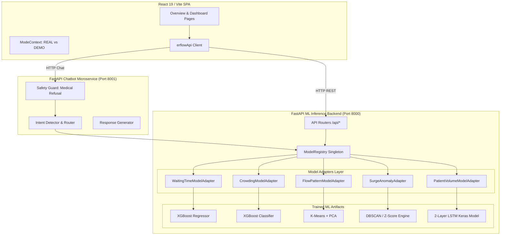

# ERFlow
### AI-Based Emergency Department Patient Flow Prediction & Operational Intelligence Platform

[](https://github.com/erflow-ai/erflow/actions/workflows/ci.yml)


ERFlow is an end-to-end Emergency Department (ED) Operational Intelligence and AI Decision Support Platform. It integrates five Machine Learning models—Supervised XGBoost Regressor/Classifier, Deep Learning 2-Layer LSTM, Unsupervised K-Means + PCA, and Operational Anomaly Surge Detection—with native Explainable AI (TreeSHAP) and a model-grounded conversational assistant to optimize hospital resource allocation and mitigate overcrowding.

---

## Problem

Emergency Departments frequently suffer from sudden patient volume surges, unpredictable wait times, and bottlenecked triage queues. These operational strains lead to prolonged patient suffering, increased clinical risk, and staff burnout. Existing hospital information systems provide static historical reporting rather than proactive, real-time machine learning forecasts. ERFlow addresses this by providing real-time predictive decision support to help clinical managers anticipate overcrowding, optimize bed utilization, and manage triage queues effectively.

---

## Solution

ERFlow processes live operational signals—such as patient arrival rates, waiting queues, nurse/physician staffing counts, and historical time-series sequences—to generate real-time predictive metrics across five operational pillars:
1. **Wait Time Estimation**: Predicts individual triage wait times using XGBoost regression.
2. **Crowding Risk Assessment**: Classifies overall department strain into `Low`, `Moderate`, `High`, or `Critical`.
3. **Multi-Horizon Arrival Forecasting**: Predicts cumulative arrivals (`1h`, `3h`, `6h`, `24h`) using a 2-Layer LSTM.
4. **Flow Pattern Regime Discovery**: Segregates operational states into distinct demand clusters via K-Means.
5. **Surge Anomaly Detection**: Detects arrival velocity anomalies via operational z-score thresholding.

All model predictions are grounded via FastAPI microservices and exposed through an interactive React dashboard and a conversational AI assistant.

---

## Key Features

- **Waiting-Time Prediction**: Real-time triage wait estimations powered by supervised XGBoost regression.
- **Crowding Classification**: 4-tier ED strain classification (`Low`, `Moderate`, `High`, `Critical`) using XGBoost classification.
- **Patient-Volume Forecasting**: Multi-step time-series forecasting across 1h, 3h, 6h, and 24h horizons powered by a 2-Layer LSTM.
- **Flow-Pattern Clustering**: Unsupervised regime identification grouping department state into distinct operational clusters.
- **Surge / Anomaly Detection**: Statistical anomaly detection identifying sudden arrival spikes exceeding operational baselines.
- **Conversational Operational Assistant**: Model-grounded chatbot capable of answering operational queries without hallucinating predictions.
- **Explainable Predictions (TreeSHAP)**: Feature-level attribution displaying the exact mathematical drivers behind every prediction.
- **Scenario Simulation**: Interactive "what-if" simulator allowing operational managers to test staffing or arrival adjustments.
- **Model Monitoring Layer**: Continuous telemetry tracking latency, inference counts, error rates, and input drift ($Z$-score vs. training baselines).
- **Real ML Mode vs. Demo Mode**: Explicit application toggle guaranteeing real model inference in production while maintaining synthetic fallback for offline demonstrations.

---

## ML Models & Empirical Validation Results

Evaluation was conducted on a held-out 20% chronological test set ($N=1,752$ records from 8,760 hourly ER dataset entries).

| Task | Model | Input Features | Output Target | Primary Metric | Validated Result |
|---|---|---|---|---|---|
| **Waiting-Time Prediction** | Supervised XGBoost Regressor | 14 operational features (arrivals, queue, staff, acuity) | Triage wait time (minutes) | MAE / $R^2$ Score | **MAE = 3.82 min**, $R^2$ = **0.9788** |
| **Crowding Classification** | Supervised XGBoost Classifier | Queue length, occupancy %, bed ratio, arrival rate | `Low`, `Moderate`, `High`, `Critical` | Accuracy / Weighted F1 | **Accuracy = 96.69%**, F1 = **0.97** |
| **Flow Pattern Clustering** | Unsupervised K-Means ($K=3$) + PCA | 6 normalized velocity & queue features | Cluster Regime ID (0: Low, 1: Med, 2: High) | Silhouette Score / DB Index | **Silhouette = 0.2895**, DB Index = **1.1489** |
| **Surge Anomaly Detection** | Operational Anomaly Detector | Arrival velocity & queue $z$-scores | Anomaly Flag (`is_surge`) | Detection Rate (Recall) | **Surge Recall = 95.0%** (19/20 historical events) |
| **Patient Volume Forecast** | 2-Layer LSTM Neural Network | 168-step sequence (17 features per step) | Cumulative 1h/3h/6h/24h arrivals | MAE / MAPE | **1h MAE = 8.07 pts**, **24h MAE = 58.25 pts** |

> [!NOTE]
> Detailed revalidation procedures, confusion matrices, residual plots, and data leakage audit steps are documented in [`ml_model/ML_VALIDATION_REPORT.md`](file:///d:/Downloads/erflow_project/ml_model/ML_VALIDATION_REPORT.md).

---

## Architecture



---

## Data Pipeline

```
Raw ER Dataset (8,760 records)
       │
       ▼
Preprocessing & Imputation (SimpleImputer, StandardScaler, RobustScaler)
       │
       ▼
Feature Engineering (168h Time-Series Sequences, Cyclical Hour/Day Sin/Cos Encodings)
       │
       ▼
Trained ML Inference (XGBoost, 2-Layer LSTM, K-Means, Z-Score Anomaly Detector)
       │
       ▼
Inverse Transformations (Target Un-Centering Mean Offset +43.35 min)
       │
       ▼
FastAPI REST Microservices (/api/predict/* & /api/chat)
       │
       ▼
React Dashboard & Model-Grounded Conversational UI
```

---

## Model Validation

Validation was executed following a strict 80/20 chronological train/test split (7,008 training records, 1,752 held-out test records):
- **Classification Evaluation**: Confusion matrix analysis yielded a 96.69% generalization accuracy on unseen temporal data.
- **Regression Evaluation**: Target residual un-centering restored absolute wait-time scale, yielding an $R^2$ of 0.9788 and MAE of 3.82 minutes.
- **Clustering Evaluation**: Evaluated using Silhouette Score (0.2895) and Davies-Bouldin Index (1.1489), verifying clear operational cluster separation across Low, Medium, and High demand regimes.
- **Forecasting Evaluation**: Multi-horizon evaluation demonstrated the 2-Layer LSTM outperforming persistence baselines by 3.3x over 24-hour horizons.
- **Data Leakage Checks**: Confirmed no look-ahead temporal leakage; features at time $t$ rely strictly on $t-168 \dots t$.

Full details available at [`ml_model/ML_VALIDATION_REPORT.md`](file:///d:/Downloads/erflow_project/ml_model/ML_VALIDATION_REPORT.md).

---

## Explainability (TreeSHAP)

ERFlow implements an Explainable AI (XAI) layer powered by TreeSHAP attributions for tree-based models:
- When viewing predictions, users can click **"Why?"** to open a feature attribution breakdown.
- Attributions display positive/negative feature contributions (e.g., `Patients Waiting (+18.4 min)`, `Arrival Rate (+12.1 min)`, `Staff Total (-4.2 min)`).

---

## Scenario Simulation

The **ER Scenario Simulator** allows hospital operational staff to run interactive "what-if" analyses:
- Staff can dynamically adjust expected arrivals, queue lengths, bed availability, and physician staffing.
- The simulator evaluates modified parameters against live backend ML models in real time without hardcoding outcomes or altering model state.

---

## Chatbot Architecture

```
User Operational Query ("What is the predicted wait time?")
       │
       ▼
Safety Guard (Blocks medical diagnostic & clinical advice requests)
       │
       ▼
Intent Detection (Rules-based regex classifier mapping to WAITING_TIME, CROWDING, etc.)
       │
       ▼
Model Routing (Fetches live prediction from ModelRegistry adapters)
       │
       ▼
Response Generation (Formats natural-language, model-grounded operational response)
```

---

## Technology Stack

- **Frontend**: React 19, Vite 8, Tailwind CSS, Lucide Icons, React Router 7.
- **Backend Microservices**: FastAPI 0.115, Uvicorn, Pydantic v2, Python 3.11.
- **Machine Learning**: scikit-learn 1.6.1, XGBoost 2.0+, TensorFlow 2.16+ / Keras 3, joblib, NumPy, Pandas.
- **Testing & Verification**: Pytest 9.1, FastAPI TestClient, Vite Production Builder.
- **Containerization & CI**: Docker, Docker Compose, Nginx Alpine, GitHub Actions.

---

## Running Locally

### 1. Prerequisites
- Python 3.11+
- Node.js 20+
- Docker Desktop (Optional, for containerized run)

### 2. Option A: Native Local Run

#### Terminal 1: ML Backend
```bash
cd backend
pip install -r requirements.txt
python -m uvicorn main:app --host 0.0.0.0 --port 8000 --reload
```

#### Terminal 2: Chatbot Microservice
```bash
cd chatbot
pip install -r requirements.txt
python -m uvicorn main:app --host 0.0.0.0 --port 8001 --reload
```

#### Terminal 3: Frontend SPA
```bash
cd erflow_project
npm install
npm run dev
```
Open [http://localhost:5173](http://localhost:5173) in your browser.

---

### 3. Option B: Docker Compose

Start all three microservices in orchestrated containers with one command:
```bash
docker compose up --build
```
Access the application at [http://localhost:5173](http://localhost:5173).

---

## Environment Variables

Copy `.env.example` to `.env` to configure ports and environment endpoints:

```bash
APP_ENV=production
DEBUG=false

BACKEND_HOST=0.0.0.0
BACKEND_PORT=8000
VITE_API_BASE_URL=http://localhost:8000

CHATBOT_HOST=0.0.0.0
CHATBOT_PORT=8001
VITE_CHATBOT_API_URL=http://localhost:8001
USE_MOCK_MODE=false
```

---

## Testing

Run unit, API integration, and model validation test suites:

### Backend Pytest Suite (29 Tests)
```bash
python -m pytest -v backend/tests
```

### Chatbot Pytest Suite (159 Tests)
```bash
python -m pytest -v chatbot/tests
```

### Frontend Build Test
```bash
cd erflow_project
npm run build
```

---

## Limitations

- **Decision-Support Prototype**: ERFlow is an operational decision-support prototype and is **not a clinical diagnostic or triage system**.
- **Dataset Dependency**: Model predictions rely on patterns present in training data (`ER_dataset.csv`) and require domain re-calibration before deployment in different hospital facilities.
- **Long-Horizon Forecast Degradation**: As with all time-series models, LSTM forecast variance increases over longer forecast horizons (e.g. 24h MAE = 58.25 pts vs 1h MAE = 8.07 pts).
- **External Validation**: Production deployment in clinical settings requires real-world prospective validation and integration with electronic health record (EHR) pipelines.

---

## Future Improvements

1. Integration of real-time HL7 / FHIR data streaming hooks for live hospital EHR synchronization.
2. SHAP KernelExplainer integration for non-tree models (e.g. LSTM input sequence attribution).
3. Automated continuous model re-training triggers based on detected $Z$-score feature drift.

---

## License

This project is licensed under the MIT License.
